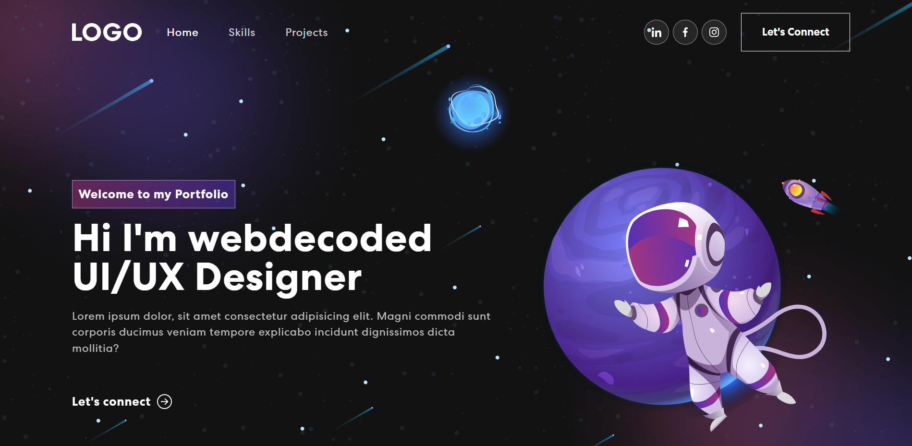
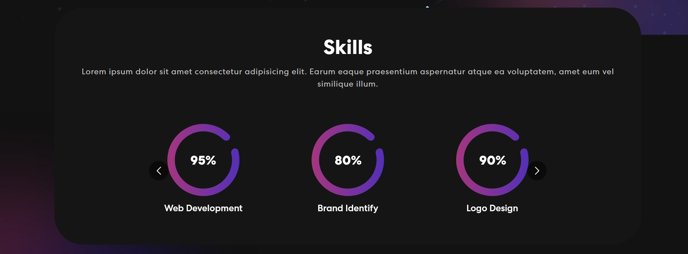
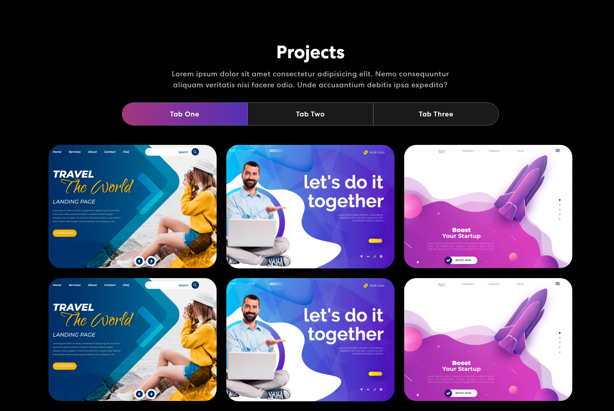
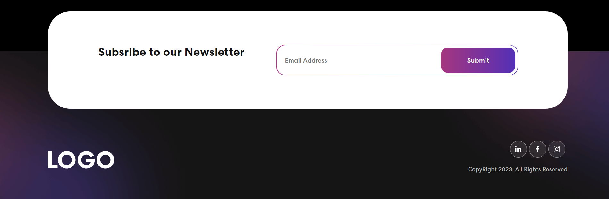

# React Portfolio 06
This design is inspired by the work of [webdecoded](https://www.youtube.com/@webdecoded). Click [here](https://youtu.be/hYv6BM2fWd8) to watch the video.

## Technologies
This web page was made with the following technologies:
- HTML5
- CSS3
- JavaScript
- React
- React Bootstrap
- React Bootstrap Icons
- React Mailchimp Subscribe
- React Multi Carousel
- React On Screen
- Animate CSS
- Bootstrap

## Pages
This project contains 4 sections: **Banner**, **Skills**, **Projects** and **Footer**.

### Home
#### In this section you will see a subtitle, a title and a small description. On the right side you will see an animated image.

### Skills
#### In this section you will see a title and a short description. A small list of skills with their respective title and percentage.

### Projects
#### In this section you will see a title and a short description. Multiple completed projects, and if you hover over one of them, a description of the project will be displayed. There are additional tabs where you can put more projects.

### Footer
#### In this section you will see a field where you can enter your email and subscribe to our newsletter. This section is not functional, some bugs still need to be fixed.

